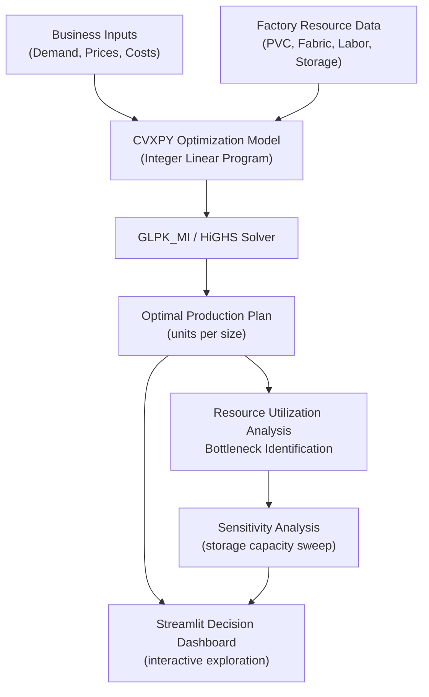
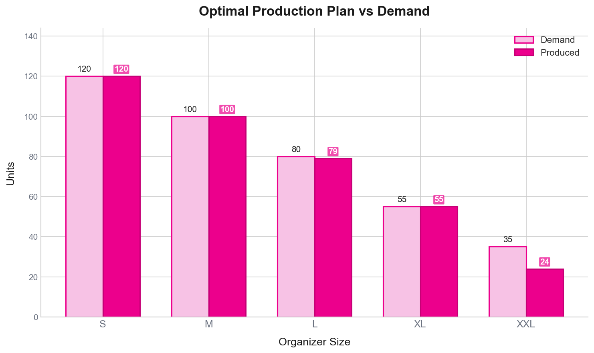
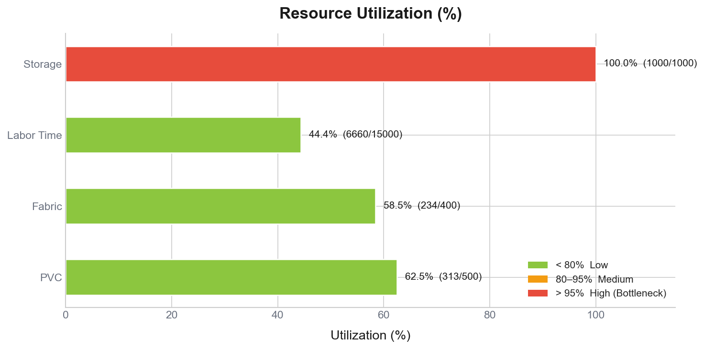
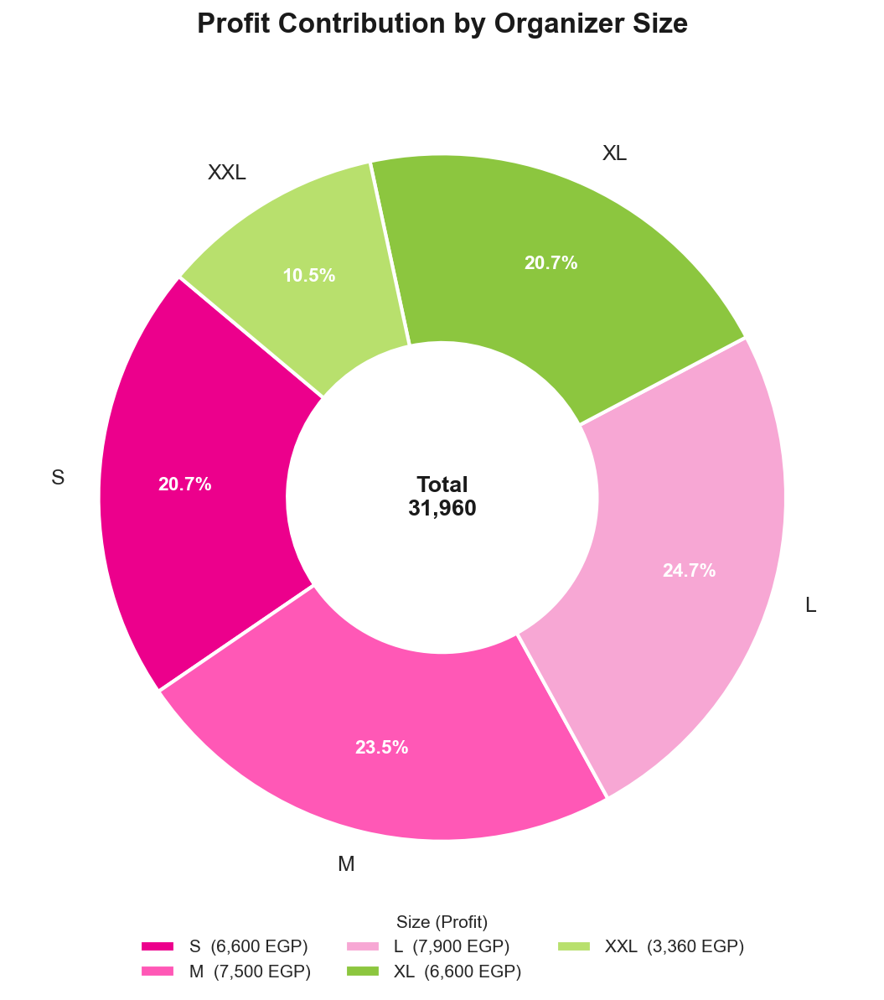
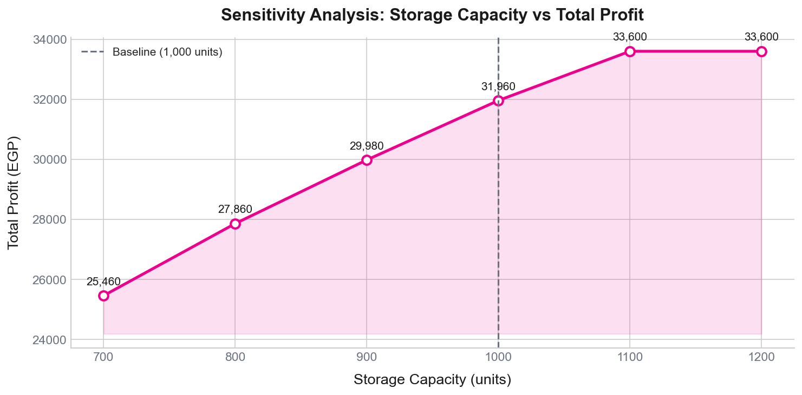
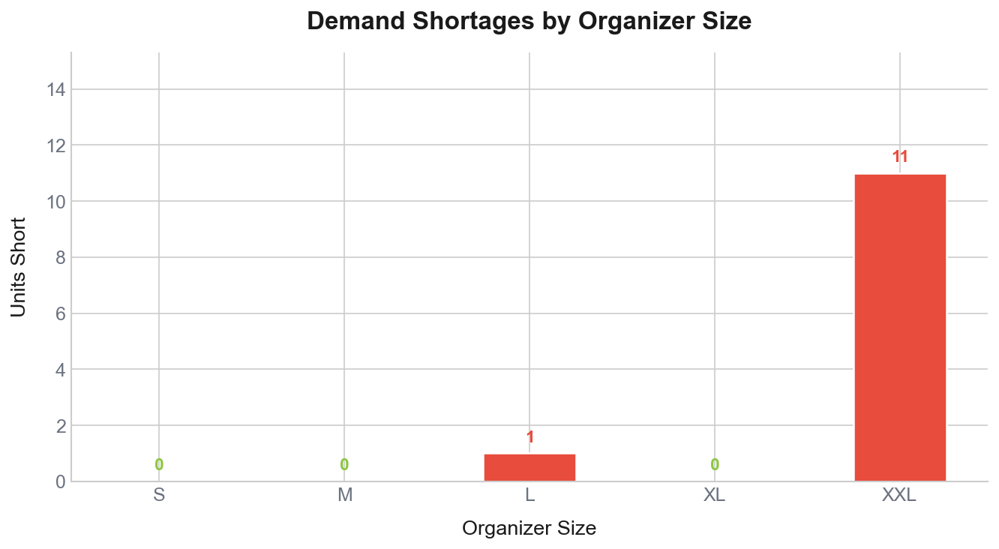

# Easy Organizer Production Optimization

**Production Planning & Resource Optimization Using Mathematical Programming**

---

## Overview

Easy Organizer is a production-planning optimization system built for a real manufacturing context: a factory that produces PVC-and-fabric desk organizers in five sizes (S, M, L, XL, XXL).

Production planning for multi-product factories is a genuinely difficult problem. Every size of organizer competes for the same scarce resources — PVC sheet material, fabric lining, labor time, and warehouse storage — while each has its own demand ceiling and profit margin. A decision made by intuition or spreadsheet is almost always suboptimal. The wrong product mix leaves profit on the table, creates unnecessary shortages, or wastes constrained resources.

This project solves that problem rigorously using **Integer Linear Programming (ILP)** via the CVXPY optimization library. The solver determines the exact production quantity for each organizer size that maximizes total profit while satisfying every physical and operational constraint. The result is an interactive Streamlit dashboard that lets planners explore the optimal solution, adjust parameters, and understand the sensitivity of the optimum to changes in available resources.

---

## Business Problem

The factory produces five organizer sizes — **S, M, L, XL, XXL** — each with a fixed selling price, production cost, and resulting profit per unit. Each unit also consumes a known quantity of four shared resources:

| Size | Selling Price | Production Cost | **Profit / Unit** | PVC (m²) | Fabric (m²) | Labor (min) | Storage (units) | Weekly Demand |
|------|--------------|----------------|-------------------|-----------|-------------|-------------|-----------------|---------------|
| S    | 120          | 65             | **55**            | 0.45      | 0.30        | 10          | 1               | 120           |
| M    | 170          | 95             | **75**            | 0.70      | 0.50        | 15          | 2               | 100           |
| L    | 230          | 130            | **100**           | 0.95      | 0.75        | 20          | 3               | 80            |
| XL   | 300          | 180            | **120**           | 1.30      | 1.00        | 28          | 5               | 55            |
| XXL  | 380          | 240            | **140**           | 1.75      | 1.40        | 35          | 7               | 35            |

The four factory resource limits (weekly):

| Resource        | Weekly Limit  |
|-----------------|---------------|
| PVC Available   | 500 m²        |
| Fabric Available| 400 m²        |
| Labor Time      | 15,000 min    |
| Storage Capacity| 1,000 units   |

The challenge: **determine how many units of each size to produce to maximize total profit without violating any resource constraint or exceeding weekly demand.**

---

## Optimization Model

The model is formulated as an **Integer Linear Program (ILP)** solved using **CVXPY** with default solver (GLPK_MI / HiGHS).

### Decision Variables

| Variable | Type    | Description                                |
|----------|---------|--------------------------------------------|
| xᵢ       | Integer | Number of units to produce for size i ∈ {S, M, L, XL, XXL} |

Variables are **integer-valued** because fractional organizers cannot be produced.

### Objective Function

Maximize total weekly profit:

```
Maximize:  Σᵢ  profitᵢ · xᵢ
         = 55·x_S + 75·x_M + 100·x_L + 120·x_XL + 140·x_XXL
```

### Constraints

**Non-negativity**
```
xᵢ ≥ 0    for all i
```

**Demand caps** (cannot produce more than demand for each size)
```
xᵢ ≤ demandᵢ    for all i
```

**PVC material**
```
0.45·x_S + 0.70·x_M + 0.95·x_L + 1.30·x_XL + 1.75·x_XXL  ≤  500
```

**Fabric material**
```
0.30·x_S + 0.50·x_M + 0.75·x_L + 1.00·x_XL + 1.40·x_XXL  ≤  400
```

**Labor time**
```
10·x_S + 15·x_M + 20·x_L + 28·x_XL + 35·x_XXL  ≤  15,000
```

**Storage capacity**
```
1·x_S + 2·x_M + 3·x_L + 5·x_XL + 7·x_XXL  ≤  1,000
```

The **Streamlit dashboard** extends this base model with configurable penalty weights for material waste, labor time, storage usage, and demand shortages — enabling multi-objective trade-off exploration.

---

## System Workflow



---

## Results

Running the ILP with the baseline resource limits and default demand produces the following **optimal production plan**:

| Size | Demand | **Produced** | Shortage | Profit / Unit | **Total Profit** |
|------|--------|-------------|----------|---------------|-----------------|
| S    | 120    | **120**     | 0        | 55            | **6,600**        |
| M    | 100    | **100**     | 0        | 75            | **7,500**        |
| L    | 80     | **79**      | 1        | 100           | **7,900**        |
| XL   | 55     | **55**      | 0        | 120           | **6,600**        |
| XXL  | 35     | **24**      | 11       | 140           | **3,360**        |

**Total Optimal Profit: 31,960**

Resource utilization at this optimum:

| Resource     | Used    | Available | **Utilization** |
|--------------|---------|-----------|----------------|
| PVC          | 312.55  | 500       | **62.5%**       |
| Fabric       | 233.85  | 400       | **58.5%**       |
| Labor Time   | 6,660   | 15,000    | **44.4%**       |
| **Storage**  | **1,000** | 1,000   | **100.0% ← Bottleneck** |

**Key finding:** Storage capacity is the binding constraint. The factory has ample PVC, fabric, and labor, but storage is fully consumed. The XXL size (7 storage units each) is the largest contributor to storage pressure, which is why its production falls short of demand.

---

## Visual Results

### Optimal Production Plan



The solver meets full demand for S, M, and XL sizes. L is one unit short and XXL is 11 units short — a direct result of the storage constraint becoming the binding limit before full demand can be satisfied.

---

### Resource Utilization



Storage is consumed to 100%, confirming it is the active bottleneck. PVC (62.5%), Fabric (58.5%), and Labor (44.4%) have significant remaining slack — increasing storage capacity would allow the factory to exploit these unused resources and raise total profit.

---

### Profit Contribution by Size



Despite having the highest per-unit profit, XXL contributes the least to total profit because its large storage footprint limits the quantity that can be produced. M and L contribute the most to total profit.

---

### Sensitivity Analysis — Storage Capacity vs Total Profit



The storage sensitivity analysis confirms the bottleneck finding quantitatively. Increasing storage from 700 to 1,100 units increases profit from 25,460 to 33,600. Beyond 1,100 units the optimum plateaus (all demand is met), demonstrating the point at which storage ceases to be a binding constraint.

---

### Demand Shortages by Size



Only L (1 unit) and XXL (11 units) have shortages. All other sizes are fully met. This chart helps planners prioritize which sizes to address if additional storage becomes available.

---

## Sensitivity Analysis

The notebook performs a parametric sweep of the storage capacity limit across six scenarios: 700, 800, 900, 1,000, 1,100, and 1,200 units, solving the ILP independently at each level.

Key observations:
- **Storage ≤ 1,000 units:** Storage is the active binding constraint. Profit increases monotonically with storage capacity.
- **Storage = 1,100 units:** Full demand can be satisfied (S: 120, M: 100, L: 80, XL: 55, XXL: 35), yielding maximum achievable profit of **33,600**.
- **Storage ≥ 1,100 units:** The optimum plateaus; additional storage provides no further benefit.
- **PVC and Labor:** Separate sweeps over PVC (350–600 m²) and Labor Time (9,000–19,000 min) show that the optimal profit remains constant at **31,960** across all tested levels — confirming these resources are *not* bottlenecks under the baseline configuration.

This directly supports the business recommendation: **the highest-ROI capacity investment is adding warehouse storage**, not procuring additional PVC or hiring more labor.

---

## Interactive Dashboard

The Streamlit application (`app.py`) provides a five-page decision-support interface:

**Overview**
- Executive KPI cards: objective value, total profit, storage used, total shortage, and main bottleneck.
- Production snapshot table comparing demand vs. produced quantity per size.
- Resource health progress bars showing live utilization percentages.

**Optimization Inputs**
- Sliders to adjust all four resource limits (PVC, fabric, labor, storage).
- Number inputs to set per-size demand.
- Sliders for five objective weights: profit weight (α), waste penalty (β), time penalty (γ), storage penalty (δ), and shortage penalty (ε).
- Re-runs the CVXPY solver instantly on parameter change.

**Production Results**
- Full results table with demand, produced, shortage, profit per unit, total profit, and resource consumption per size.
- CSV download button.
- Cards identifying the most-produced size, highest-profit contributor, and size with highest shortage.

**Visual Analysis**
- Production vs. Demand grouped bar chart (Plotly).
- Resource Utilization horizontal bar chart.
- Profit Contribution donut chart.
- Shortage by Size bar chart.

**Business Insights**
- Dynamic bottleneck identification with contextual recommendation.
- Three strategic action cards: increase high-profit production, reduce shortages, improve resource efficiency.

> **Running the dashboard:**
> ```bash
> streamlit run app.py
> ```
> The application opens at `http://localhost:8501`.

---

## Technology Stack

| Category          | Technology                         |
|-------------------|------------------------------------|
| Language          | Python 3.x                         |
| Optimization      | CVXPY (Integer Linear Programming) |
| Solver backend    | GLPK_MI / HiGHS (via CVXPY)        |
| Dashboard         | Streamlit                          |
| Data              | NumPy, Pandas                      |
| Visualization     | Plotly (dashboard), Matplotlib (charts) |
| Navigation        | streamlit-option-menu              |
| Analysis notebook | Jupyter Notebook                   |

---

## Project Structure

```
Easy-Organizer-Production-Optimization/
│
├── app.py                          # Streamlit dashboard (5 pages)
│
├── notebooks/
│   └── EasyOrganizerOptimization.ipynb  # ILP model, sensitivity analysis, charts
│
├── assets/
│   ├── logo.png                    # Brand logo (used in dashboard sidebar)
│   └── charts/
│       ├── optimal-production-plan.png
│       ├── resource-utilization.png
│       ├── profit-contribution.png
│       ├── sensitivity-analysis-storage.png
│       └── shortage-by-size.png
│
├── requirements.txt                # Python dependencies
├── .gitignore
└── README.md
```

---

## Installation

```bash
# 1. Clone the repository
git clone https://github.com/MohameddTamerr/Easy-Organizer-Production-Optimization.git
cd Easy-Organizer-Production-Optimization

# 2. Create and activate a virtual environment
python -m venv .venv

# Windows
.venv\Scripts\activate

# macOS / Linux
source .venv/bin/activate

# 3. Install dependencies
pip install -r requirements.txt
```

---

## Running the Application

```bash
streamlit run app.py
```

The dashboard will open automatically in your browser at `http://localhost:8501`.

---

## Running the Analysis Notebook

```bash
jupyter notebook notebooks/EasyOrganizerOptimization.ipynb
```

Or open the file directly in JupyterLab / VS Code. Run all cells sequentially. The notebook requires the same dependencies as `requirements.txt`, plus `matplotlib` for the chart cells.

---

## Key Takeaways

This project demonstrates the practical application of **Operations Research** techniques to a production planning problem:

- **Integer Linear Programming** — modeling a real discrete production decision with binary/integer decision variables, a linear objective, and linear constraints.
- **Translating business requirements into constraints** — each physical and operational limit becomes a formal inequality constraint in the model.
- **Resource bottleneck identification** — by computing utilization rates at the optimal solution, the binding constraint (storage) is unambiguously identified.
- **Sensitivity analysis** — parametric sweeps reveal how much the optimal objective changes as resource capacities vary, providing quantitative guidance for investment decisions.
- **Decision-support visualization** — charts and an interactive dashboard communicate optimization results to non-technical stakeholders.
- **Multi-objective extension** — the Streamlit app implements a weighted-sum objective allowing planners to trade off profit against waste, time, storage, and shortage penalties.

---

## Team

This project was developed collaboratively by:

- **Mohamed Tamer** — [github.com/MohameddTamerr](https://github.com/MohameddTamerr)
- **Menna Allah Mohamed Adel** — [github.com/mennaaadell](https://github.com/mennaaadell)
- **Ahmed Ramy** — [github.com/ahmedramy10](https://github.com/ahmedramy10)
- **Marwan Ragab**
- **Farida Sherief**

*Developed as part of an Optimization Techniques course project.*
